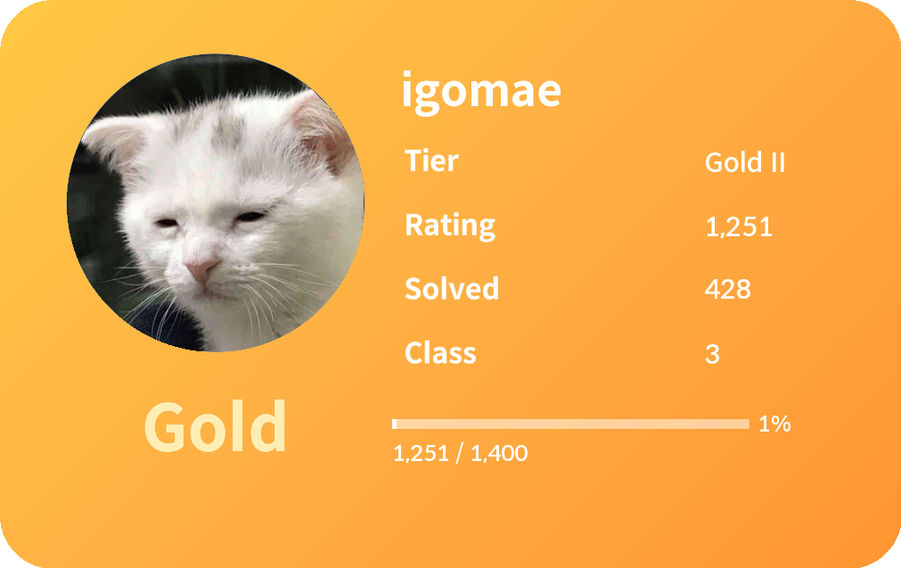

# solved.ac 프로필 카드 만들기!

## python ver
python 3.10

## Require Library
`httpx`, `PIL`

## How To Use
1. main.py를 실행시킵니다.    
2. BOJ 아이디를 입력합니다.     
2. 프로필 카드 완성~     
4. 프로필카드는 profile 폴더 안에 생성됩니다.    

## Roles of Files
### main.py   
실행파일입니다.

### api.py 
solved.ac에서 입력한 사용자의 정보를 가져오는 함수를 구현한 파일입니다. 이 함수는 `user_info` 딕셔너리를 반환합니다.    
다음은 `user_info `딕셔너리에서 정보에 접근하는 `key`입니다.
- 아이디 `'handle'`
- 현재 티어 `'tier'`
- 티어 인덱스 `'tier_idx'` : 이것이 api를 통해 받아온 정보이고, `현재 티어`는 인덱스를 통해 변환한 값입니다.
- 현재 레이팅 `'rating'`
- 푼 문제 수 `'solved'`
- 클래스 `'class'`
- 프로필사진 경로 `'profile_image'`

### rating.py
사용자의 티어에 따라 다음을 계산하는 함수를 구현한 파일입니다. 이 함수는 두 가지 값을 반환합니다.
- `now_rating` : '현재 레이팅 / 승급 조건 레이팅' 꼴의 문자열
- `progress` : 현재 티어에서의 진척도

### make_profile.py    
프로필 카드를 만드는 함수를 구현한 파일입니다. 